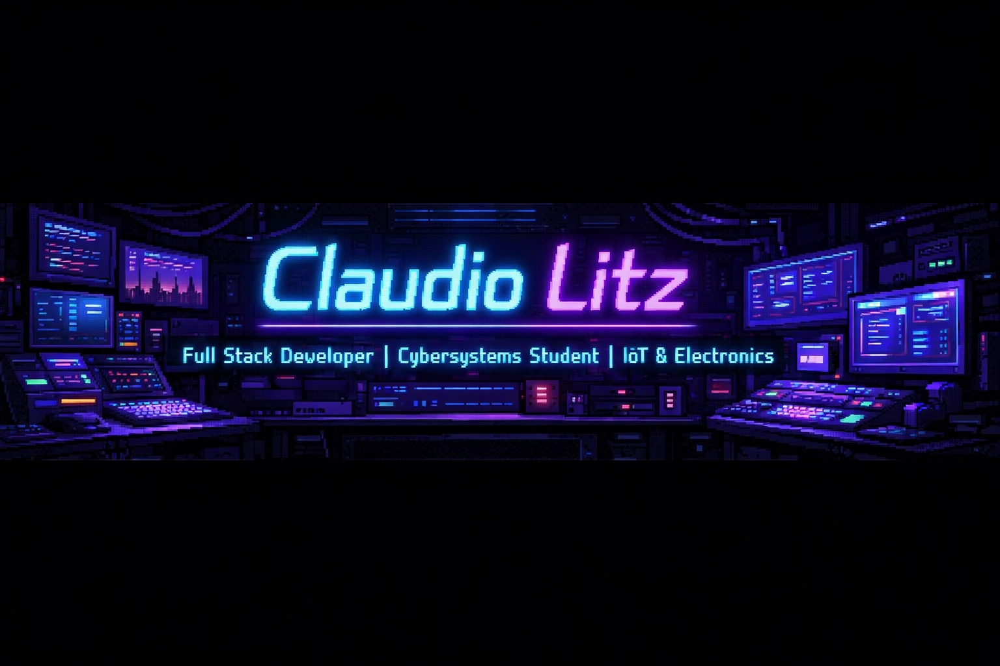

  

  
  

## 🚀 Technologies & Ecosystem

  
  
  
  
  
  
  
  
  

### 🔗 Full Stack & IoT Connectivity
I specialize in building end-to-end systems where everything is interconnected. My passion lies in creating the bridge between **Front-end interfaces**, **Back-end logic**, **Database persistence**, and **Hardware sensors**.

  

## 📈 GitHub Activity

  

## 🌐 Connect with me

  
  

---

  

  Made with ❤️ by Manus AI

